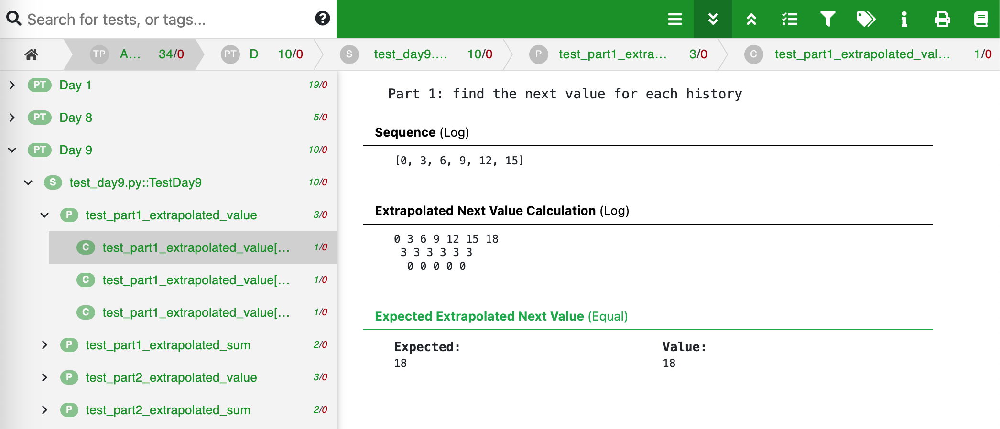

## Hello! 👋
This is my [Advent of Code 2023](https://adventofcode.com/2023/) project! I code with python and test with [testplan](https://github.com/morganstanley/testplan).



## How to Run
### testplan
```sh
# all the days
python tests/test_plan.py -v
# specific day
python tests/test_plan.py -v --pattern="Day 1"

# display testplan report
tpsreport display fromjson report/report.json
```

### testplan with coverage
```sh
python tests/test_plan.py --coverage -v
coverage report -m
coverage html

# now coverage report is under htmlcov/index.html
```

## License
See [License](LICENSE)